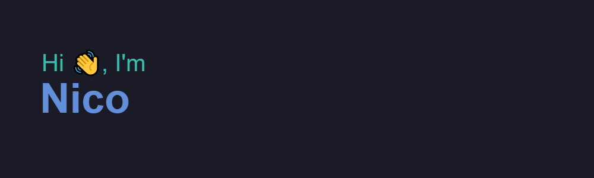

- 🔭 I’m currently working on EDAG Engineering Spain
- 🌱 I’m currently learning React/JS for frontend and Python/C# for backend/ML/Data Science.
- 👯 I’m looking to collaborate on Computational Science projects (ML, Data Science, Algorithmic efficency, etc...), but I'm always open to learning new things!
- 📫 How to reach me: nicollorenss@gmail.com

